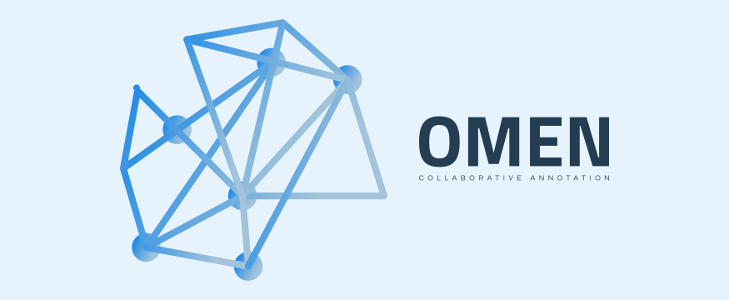

[](https://opensource.org/licenses/MIT)
[](https://github.com/FrankGrimm/omen/packages)


# OMEN - A collaborative, annotation platform



## Introduction

The OMEN platform is a self-hosted annotation paltform with multi-user support. It is deployed as a [Docker](https://www.docker.com/) container and, by default, backed by a [PostgreSQL](https://www.postgresql.org/) database. It is maintained by the [Semantic Computing Group](http://www.sc.cit-ec.uni-bielefeld.de/home/) at the [Center for Cognitive Interaction Technology (CITEC), Bielefeld University](https://www.cit-ec.de/en)

- Simple dataset management for document-level annotation tasks.
- Role-based dataset and task management: Users interact with datasets as either *owner*, *curator*, or *annotator* (each providing different levels of functionality and access).
- Work package definitions for annotation tasks based on subsets of your dataset.

## Visual Overview

A simple annotation task with three labels. Each label is configured to use a background color and display an icon. Annotators can either click the label buttons or press a hot-key (numbers 1-3 - for quick access to up to 9 labels):


Users with the creator or owner role can access further management functionality, e.g. browsing the dataset, seeing the distribution of all annotations, and inspecting the inter-annotator agreement on the dataset overall:


Configuring a dataset is as easy as uploading a CSV file, choosing columns to identify samples and their content, and configuring the possible labels:


## Getting started

To use OMEN on your own tasks, please make sure to install the following prerequisites:

- [Docker](https://www.docker.com/)
- [Docker compose](https://docs.docker.com/compose/)
- [PostgreSQL](https://www.postgresql.org/) (if you do not want to use the Docker compose setup below and provide your own)

The software is made available as a Docker container via [GitHub packages](https://github.com/FrankGrimm/omen/packages). For regular deployments, the [`omen-prod` package](https://github.com/FrankGrimm/omen/packages/300700) should be used.

Note that pulling images, even public ones, from GitHub's infrastructure requires authentication. A personal authentication token with the `read:packages` permission is required. Please see the [GitHub documentation](https://docs.github.com/en/packages/using-github-packages-with-your-projects-ecosystem/configuring-docker-for-use-with-github-packages#authenticating-to-github-packages) on how to set this up (`cat ~/TOKEN.txt | docker login https://docker.pkg.github.com -u USERNAME --password-stdin`).

Alternatively you can choose to pull the production image from [dockerhub](https://hub.docker.com/r/frankgrimm/omen-prod).

To pull the image using the **command line**: `docker pull docker.pkg.github.com/frankgrimm/omen/omen-prod:latest`

Our standard deployment model uses **[Docker compose](https://docs.docker.com/compose/)**. An example `docker-compose.yml` configuration that sets up a database and OMEN instance can be found in the [`examples/`](https://github.com/FrankGrimm/omen/tree/master/examples) directory of the repository. Note that this example requires mapping the database files to a volume in order to be retained when the infrastructure is restarted.

After pulling the image and configuring your preferred deployment method, make sure to:

- a) Adjust your **[configuration](docs/omen-configuration.md)** with the mandatory parameters (e.g. database connection and credentials)
- b) Provide it to the container by mapping a volume and expose the web server (running on port TCP/5000 by default) so you can reach the web application
- c) Create a first user via the command line  and try to log in (by default at `http://yourhost.domain.tld:5000`). You will only have to do this once, additional users can be created in the application itself.

_Note_ that this deployment example ends at the container level, it should be used behind a https-enabled reverse proxy (e.g. [nginx](https://www.nginx.com/), [Apache](https://httpd.apache.org/), [Caddy 2](https://caddyserver.com/v2), or similar).

```yml
   [...]
   ports:
       - "5000:5000"
   volumes:
       - ${PWD}/config.json:/home/omenuser/app/config.json
```

## Getting started (Developer edition)

Check out our [milestones](https://github.com/FrankGrimm/omen/milestones) and [issues](https://github.com/FrankGrimm/omen/issues) to see what is going on with the project. If you want to get started, go ahead and [fork](https://github.com/FrankGrimm/omen) the project. We provide two ready-to-go docker-compose configurations. These should work for most setups and are also used to configure the CI (via GitHub actions) and package releases:

- `docker-compose.dev.yml` which runs the current OMEN branch using Flask debug (featuring auto-reloading) and configures a local database within the same compose-network. This should be the default configuration for development
    ```bash
    docker-compose --env-file /dev/null -f docker-compose.dev.yml up
    ```
- `docker-compose.prod.yml` which runs a full `gunicorn` instance and is used to create the production release. This is otherwise mostly used directly when setting up test and staging environments.
    ```bash
    docker-compose --env-file /dev/null -f docker-compose.prod.yml up
    ```


